# Chat Application

This is a simple chat application built with **Node.js**, **Express**, **Socket.io**, and **MongoDB**. It allows users to **join rooms**, **send messages** (both **group** and **private**), and interact in **real-time**.

## Features

- **User Authentication** (Sign Up, Log In)
- **Real-time Chat** with Socket.io
- **Join and Leave Rooms**
- **Send Group and Private Messages**
- **Display Typing Indicator**
- **Message History** (Loaded on room join)

- **Screenshot 1:** 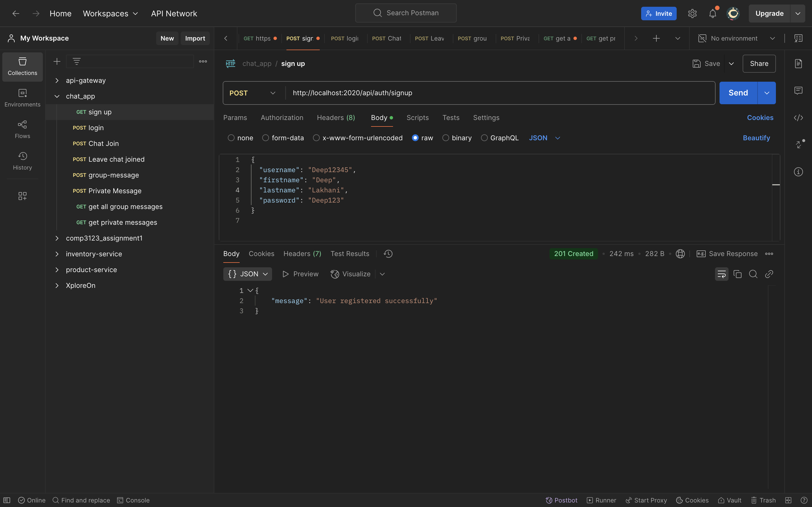
- **Screenshot 2:** 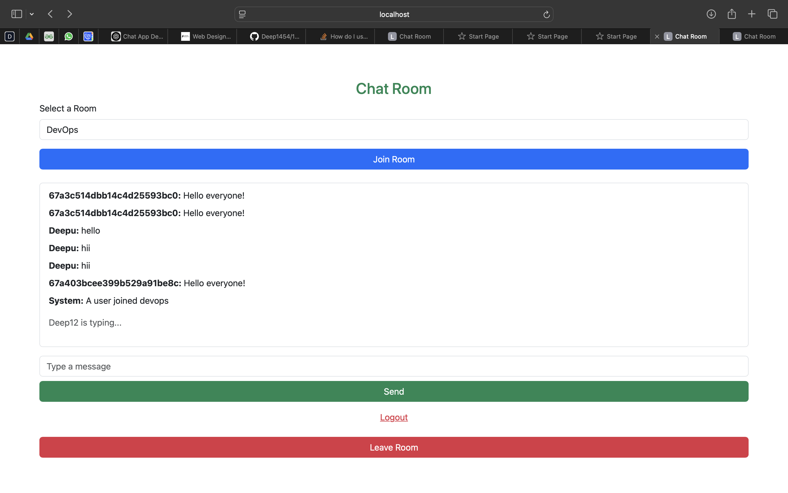
- **Screenshot 3:** 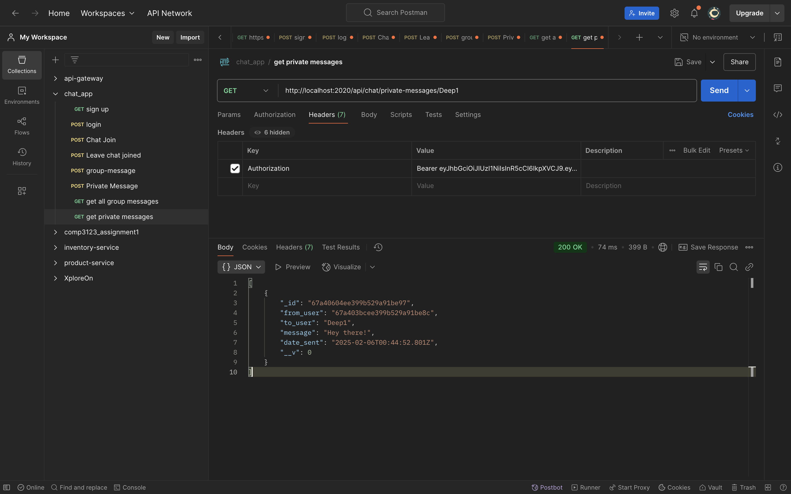
- **Screenshot 4:** 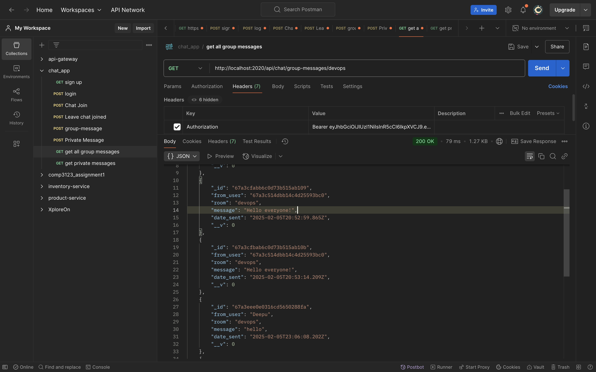
- **Screenshot 5:** 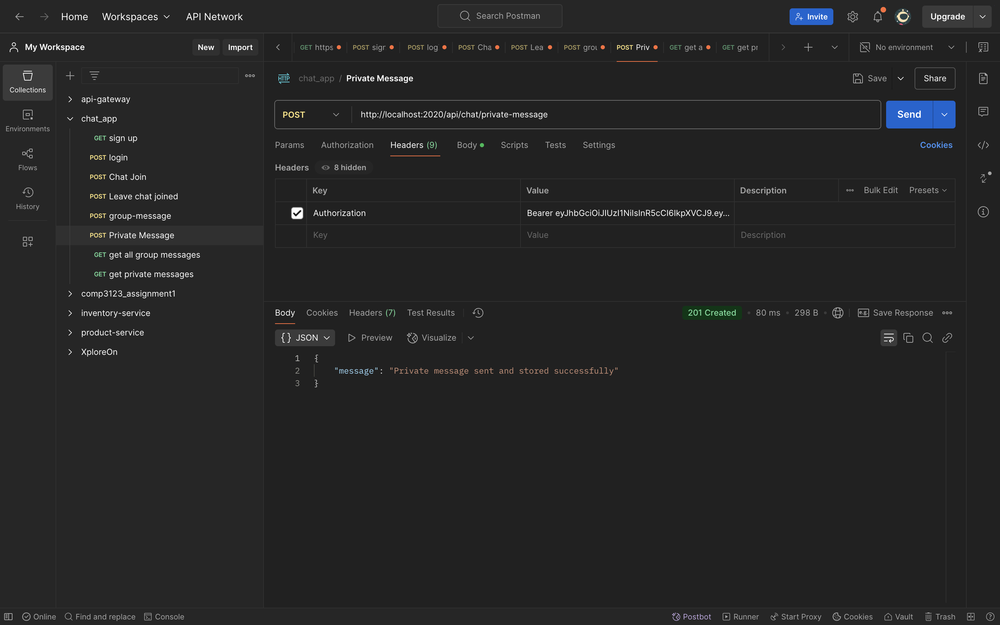
- **Screenshot 6:** 
- **Screenshot 7:** 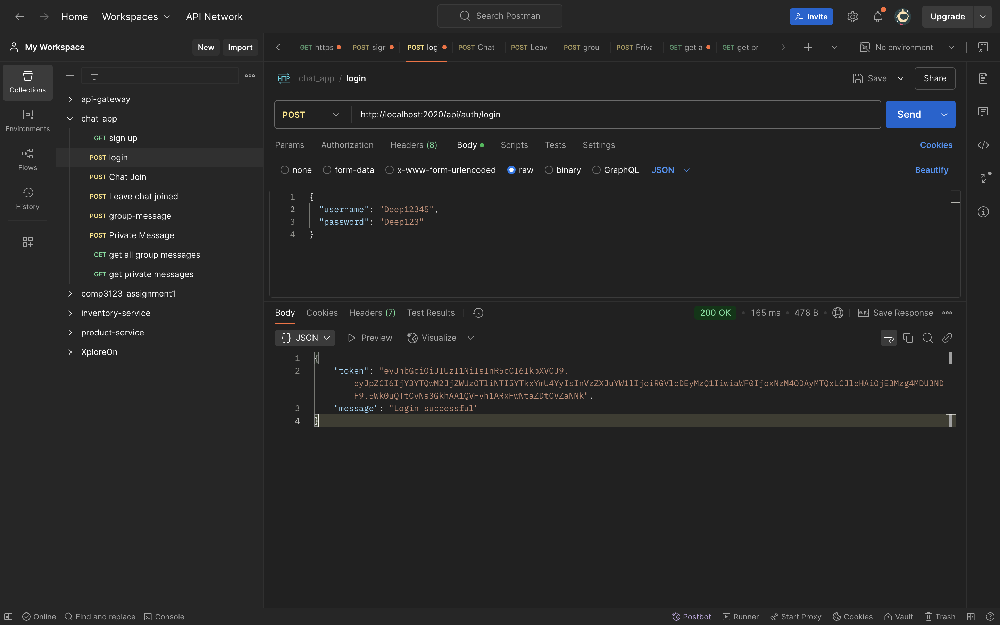
- **Screenshot 8:** 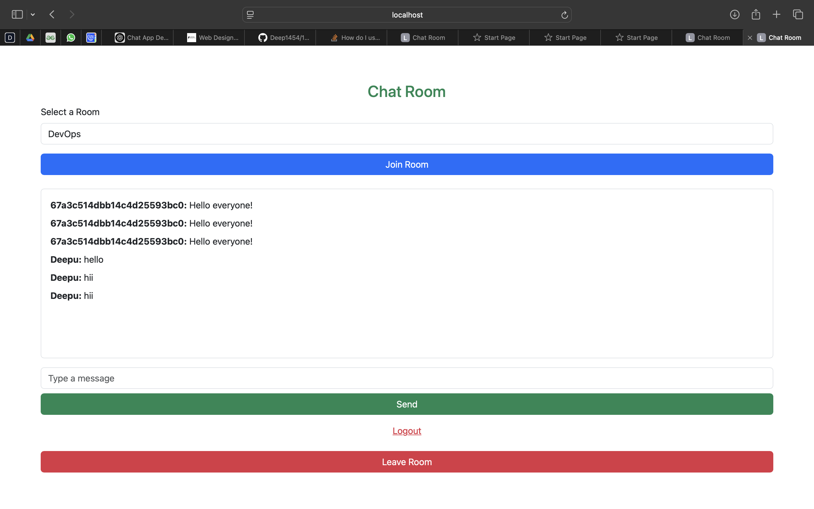
- **Screenshot 9:** 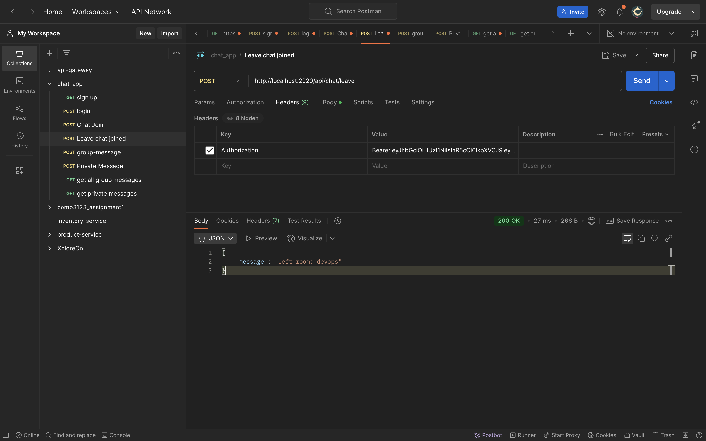
- **Screenshot 10:** 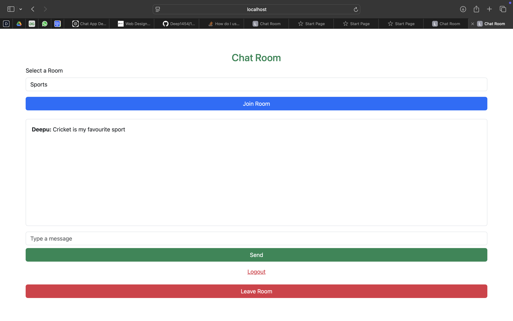
- **Screenshot 11:** 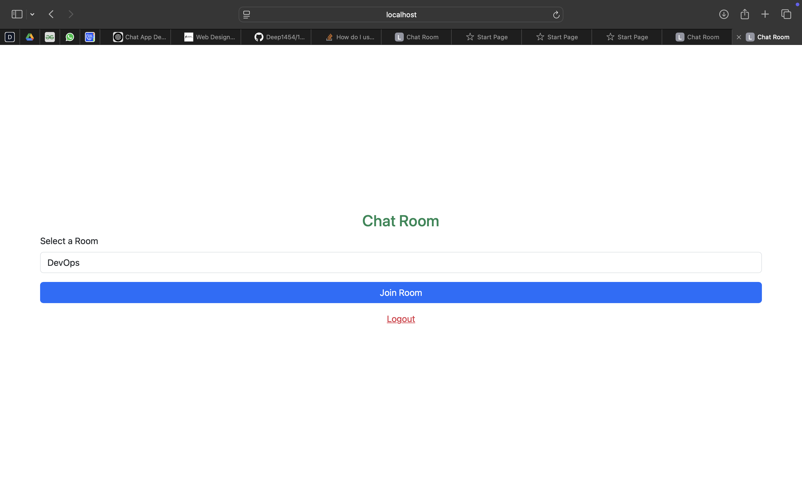
- **Screenshot 12:** 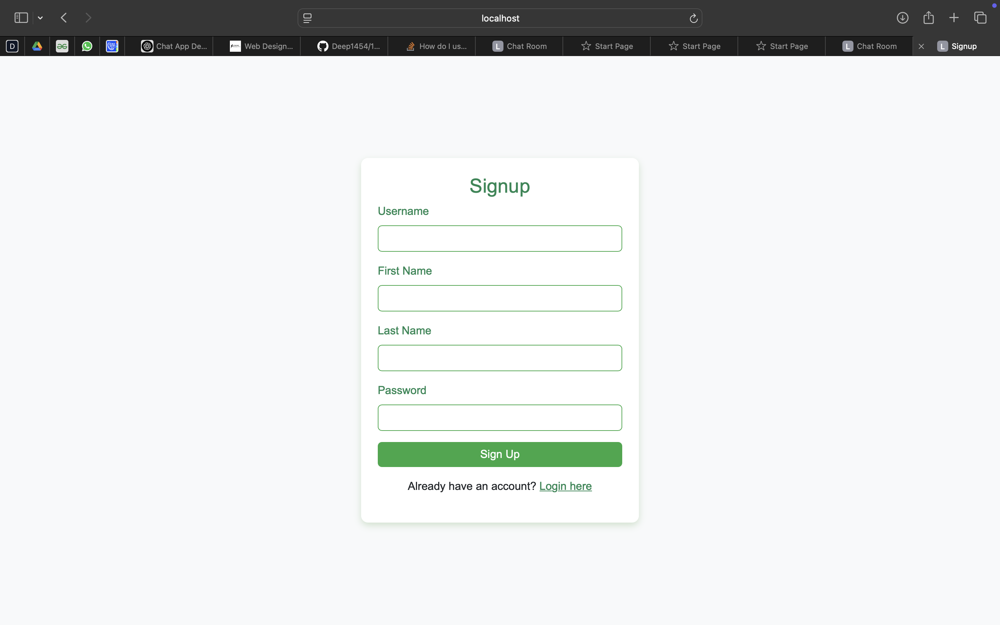
- **Screenshot 13:** 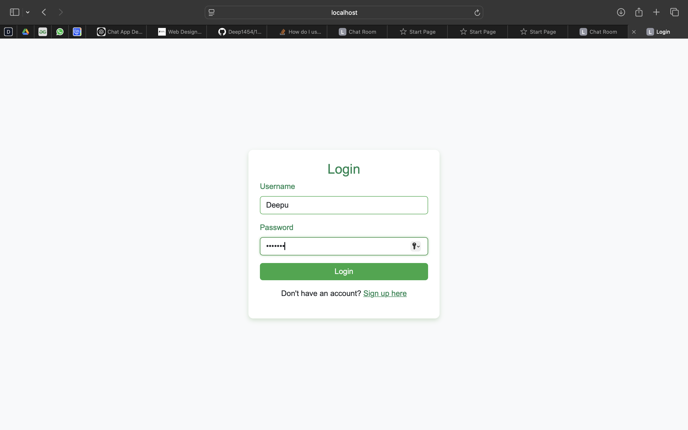
